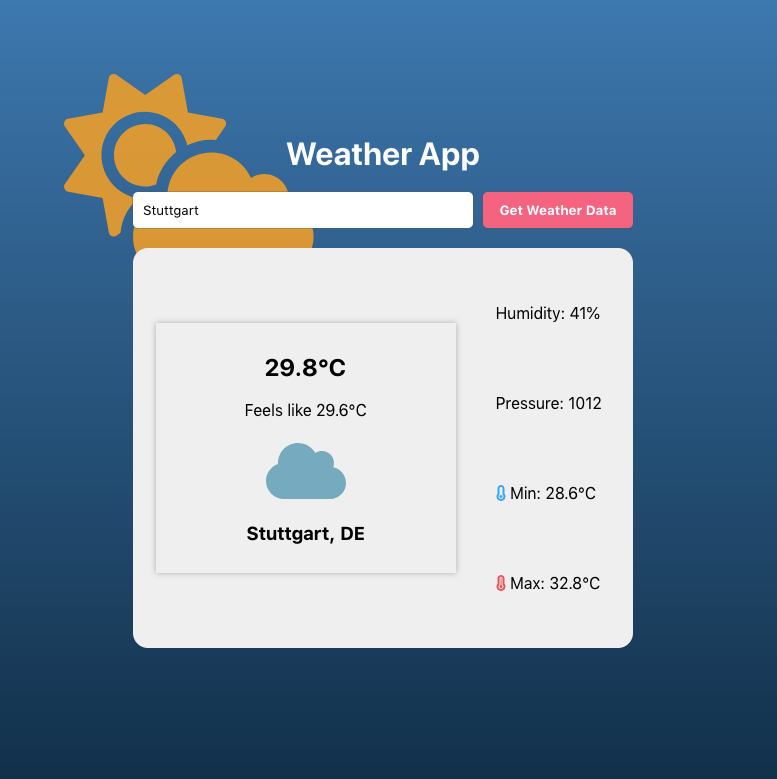

# React-Weather-App

This is a simple weather-app built in React with SASS.

The app fetches data from www.openweathermap.org based on the city name and displays it in the card component. Also, if the user allows the browser to access the user's location data, the app gets the location coordinates on page load with help of the geolocation API. It then uses reverse geocoding using the postionstack API (www.positionstack.com) to retrieve the city based on those coordinates and renders the according weather data.

<strong>https://react-weather-forecast-91.netlify.app/</strong>

 

